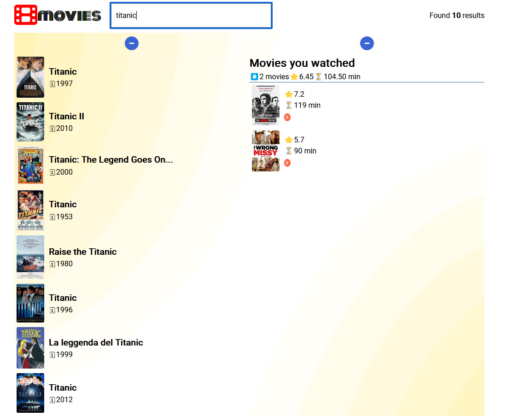

# Movie App

## Overview

A React-based web application that leverages the OMDb API to retrieve movie information. The app has numerous features, including searching for movies, viewing in-depth details about selected films, and adding or removing movies from a watchlist. To ensure the app's state is always accessible, I incorporated local storage.

### Screenshot

### Links

- Solution URL: [https://github.com/MitaliShah/discoverMovies](https://github.com/MitaliShah/discoverMovies)
- Live Site URL: [https://main--idyllic-sherbet-48a55c.netlify.app/](https://main--idyllic-sherbet-48a55c.netlify.app/)
